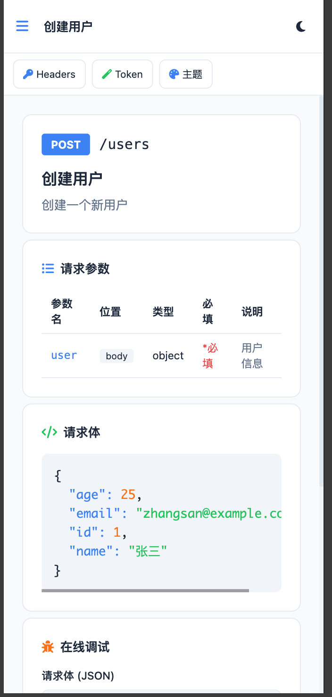
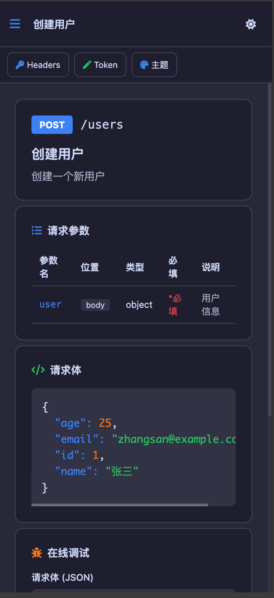

# QingFeng Swag by wdc

English | [中文](./README.md)

⚡️ A beautiful and powerful Swagger UI alternative, designed for Go Gin framework.

> Better API documentation experience for Go developers.

## 📸 Preview

### Default Theme


### Modern Theme


### Minimal Theme


### Dark Mode


### Online Debug


### Mobile
| Light Mode | Dark Mode |
|:----------:|:---------:|
|  |  |

## ✨ Features

- 🎨 **Multiple Themes** - Default, Minimal, Modern UI styles
- 🌓 **Dark/Light Mode** - Theme switching support
- 🎯 **Theme Colors** - Blue, Green, Purple, Orange, Red, Cyan
- 🔍 **Quick Search** - Real-time API search (Ctrl+K shortcut)
- 🐛 **Online Debug** - Built-in API testing tool, like Postman
- 🔑 **Global Headers** - Configure global headers (e.g., Authorization)
- 🪄 **Token Auto-Extract** - Auto-extract token from response
- 🔄 **Auto Generate** - Auto run swag init on startup
- 📦 **Zero Frontend Dependencies** - Embedded with embed.FS
- 🚀 **Easy Integration** - One line of code to integrate
- 📱 **Mobile Support** - Fully responsive with drawer navigation
- 💾 **Persistent Settings** - Theme and settings auto-saved locally
- ✨ **JSON Syntax Highlighting** - Colorful response display

## 🔄 Drop-in Replacement

If your project is already using other Swagger UI components (like gin-swagger, swaggo), you can replace them with QingFeng Swag without any code changes:

**Just two steps:**

1. Install QingFeng Swag:
```bash
go get github.com/delfDog/QingFeng
```

2. Replace route registration (keep your existing swag annotations and docs directory):

```go
// Before (gin-swagger)
import swaggerFiles "github.com/swaggo/files"
import ginSwagger "github.com/swaggo/gin-swagger"
r.GET("/swagger/*any", ginSwagger.WrapHandler(swaggerFiles.Handler))

// After (QingFeng Swag)
import qingfeng "github.com/delfDog/QingFeng"
r.GET("/doc/*any", qingfeng.Handler(qingfeng.Config{
    Title:   "My API",
    BasePath: "/doc",
    DocPath:  "./docs/swagger.json",
}))
```

**No changes needed:**
- ✅ Existing swag annotations (@Summary, @Router, etc.)
- ✅ Generated docs directory (swagger.json, swagger.yaml)
- ✅ Business code

QingFeng Swag reads `swagger.json` directly, fully compatible with swag tool.

---

## 📦 Getting Started from Scratch

### 1. Create Project

```bash
mkdir myapi && cd myapi
go mod init myapi
```

### 2. Install Dependencies

```bash
go get github.com/gin-gonic/gin
go get github.com/delfDog/QingFeng@latest
go install github.com/swaggo/swag/cmd/swag@latest
```

### 3. Create main.go

```go
package main

import (
    "github.com/gin-gonic/gin"
    qingfeng "github.com/delfDog/QingFeng"
)

// @title My API
// @version 1.0
// @description This is my first API
// @host localhost:8080
// @BasePath /api

func main() {
    r := gin.Default()

    // Register doc UI
    r.GET("/doc/*any", qingfeng.Handler(qingfeng.Config{
        Title:    "青峰API--wdc",
        BasePath: "/doc",
        DocPath:  "./docs/swagger.json",
    }))

    // API routes
    r.GET("/api/hello", hello)

    r.Run(":8080")
}

// @Summary Say hello
// @Tags Example
// @Success 200 {string} string "Hello World"
// @Router /hello [get]
func hello(c *gin.Context) {
    c.JSON(200, gin.H{"message": "Hello World"})
}
```

### 3.1 完整的配置说明（只是说明可 步骤3即可正常运行）
```go
r.GET("/doc/*any", qingfeng.Handler(qingfeng.Config{
    // 文档标题
    Title: "我的 API",
    // 文档描述
    Description: "API 文档描述",
    // API 版本号
    Version: "1.0.0",
    // 文档路由前缀
    BasePath: "/doc",
    // swagger.json 文件路径
    DocPath: "./docs/swagger.json",
    // 直接传入 swagger JSON 内容（与 DocPath 二选一）
    // DocJSON: []byte{},
    // 是否启用在线调试
    EnableDebug: true,
    // 是否默认深色模式
    DarkMode: false,
    // UI 主题风格: ThemeDefault(默认) / ThemeMinimal(简约) / ThemeModern(现代)
    UITheme: qingfeng.ThemeDefault,
    // 全局请求头配置
    GlobalHeaders: []qingfeng.Header{
        {Key: "Authorization", Value: "Bearer your-token"},
        // {Key: "X-API-Key", Value: "your-api-key"},
    },
    // 启动时自动运行 swag init 生成文档
    AutoGenerate: true,
    // swag 搜索目录（AutoGenerate 为 true 时生效）
    SwagSearchDir: ".",
    // swagger 文件输出目录（AutoGenerate 为 true 时生效）
    SwagOutputDir: "./docs",
}))

```

### 4. Generate Docs and Run

```bash
swag init
go run main.go
```

### 5. Access Documentation

Open browser: http://localhost:8080/doc/

---

## 🚀 Quick Start

```go
package main

import (
    "github.com/gin-gonic/gin"
    qingfeng "github.com/delfDog/QingFeng"
)

func main() {
    r := gin.Default()

    r.GET("/doc/*any", qingfeng.Handler(qingfeng.Config{
        Title:       "My API",
        Description: "API Documentation",
        Version:     "1.0.0",
        BasePath:    "/doc",
        DocPath:     "./docs/swagger.json",
        EnableDebug: true,
        DarkMode:    false,
        UITheme:     qingfeng.ThemeDefault, // Options: ThemeDefault, ThemeMinimal, ThemeModern
    }))

    r.Run(":8080")
}
```

Visit `http://localhost:8080/doc/` to view documentation.

## 🎨 UI Themes

Three UI styles available, configurable via `UITheme` or switchable in the interface:

| Theme | Constant | Description |
|-------|----------|-------------|
| Default | `qingfeng.ThemeDefault` | Classic blue style, full-featured |
| Minimal | `qingfeng.ThemeMinimal` | Black & white, clean and professional |
| Modern | `qingfeng.ThemeModern` | Gradient glassmorphism, visually stunning |

Switch theme via URL parameter: `http://localhost:8080/doc/?theme=modern`

Theme selection is automatically saved to browser local storage and restored on next visit.

## 📱 Mobile Support

QingFeng Swag is fully optimized for mobile devices:

- 📲 **Drawer Navigation** - Tap the menu button to open API list
- 🎯 **Top Action Bar** - Quick access to Headers, Token, Theme settings
- 💾 **Settings Sync** - Theme and settings sync across devices
- 🌓 **Dark Mode** - One-tap toggle in the top right corner

## ⚙️ Configuration

| Parameter | Type | Default | Description |
|-----------|------|---------|-------------|
| Title | string | "API Documentation" | Document title |
| Description | string | "" | Document description |
| Version | string | "1.0.0" | API version |
| BasePath | string | "/doc" | Documentation route prefix |
| DocPath | string | "./docs/swagger.json" | Path to swagger.json |
| DocJSON | []byte | nil | Pass swagger spec directly as JSON |
| EnableDebug | bool | true | Enable online debugging |
| DarkMode | bool | false | Enable dark mode by default |
| UITheme | UITheme | ThemeDefault | UI theme style |
| GlobalHeaders | []Header | nil | Global headers configuration |
| AutoGenerate | bool | false | Auto run swag init on startup |
| SwagSearchDir | string | "." | Swag search directory |
| SwagOutputDir | string | "./docs" | Swagger output directory |
| Logo | string | "" | Custom logo URL or base64 |
| LogoLink | string | "" | URL to navigate when clicking logo |
| Environments | []Environment | nil | Multi-environment configuration |

## 🌍 Multi-Environment Support

Configure multiple environments to easily switch between dev, test, and production:

```go
r.GET("/doc/*any", qingfeng.Handler(qingfeng.Config{
    Title:    "My API",
    BasePath: "/doc",
    DocPath:  "./docs/swagger.json",
    Environments: []qingfeng.Environment{
        {Name: "Local Dev", BaseURL: "http://localhost:8080/api/v1"},
        {Name: "Test", BaseURL: "https://test-api.example.com/api/v1"},
        {Name: "Production", BaseURL: "https://api.example.com/api/v1"},
    },
}))
```

## 🎨 Custom Logo

Configure a custom logo:

```go
r.GET("/doc/*any", qingfeng.Handler(qingfeng.Config{
    Title:    "My API",
    BasePath: "/doc",
    DocPath:  "./docs/swagger.json",
    Logo:     "https://example.com/logo.png", // or base64
    LogoLink: "https://example.com",          // click to navigate
}))
```

## ⌨️ Keyboard Shortcuts

| Shortcut | Function |
|----------|----------|
| `Ctrl/Cmd + K` | Focus search box |
| `Escape` | Close modal |

## 🔑 Global Headers

Pre-configure global headers that will be automatically added to all API requests:

```go
r.GET("/doc/*any", qingfeng.Handler(qingfeng.Config{
    Title:    "My API",
    BasePath: "/doc",
    DocPath:  "./docs/swagger.json",
    GlobalHeaders: []qingfeng.Header{
        {Key: "Authorization", Value: "Bearer your-token"},
        {Key: "X-API-Key", Value: "your-api-key"},
    },
}))
```

You can also configure headers dynamically via the "Global Headers" button in the UI.

## 🔄 Auto Generate Documentation

Enable `AutoGenerate` to automatically run `swag init` on every startup:

```go
r.GET("/doc/*any", qingfeng.Handler(qingfeng.Config{
    Title:         "My API",
    BasePath:      "/doc",
    AutoGenerate:  true,
    SwagSearchDir: ".",
    SwagOutputDir: "./docs",
}))
```

Requires swag to be installed:
```bash
go install github.com/swaggo/swag/cmd/swag@latest
```

## 🔧 Working with swag

1. Install swag:
```bash
go install github.com/swaggo/swag/cmd/swag@latest
```

2. Add annotations to your code:
```go
// @Summary Get user list
// @Description Get users with pagination
// @Tags User Management
// @Accept json
// @Produce json
// @Param page query int false "Page number"
// @Success 200 {object} Response
// @Router /users [get]
func getUsers(c *gin.Context) {
    // ...
}
```

3. Generate documentation:
```bash
swag init
```

4. Integrate QingFeng Swag (see Quick Start)

## 🤝 Contributing

Issues and Pull Requests are welcome!

## 📄 License

MIT License
